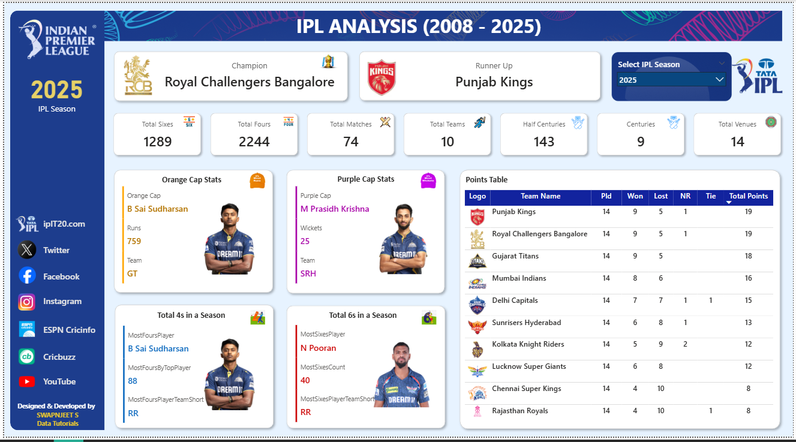

<B><I>🏏IPL Analysis Dashboard (2008–2025) — Power BI Project</B></I>

📘 Overview - 
This Power BI dashboard provides a comprehensive analysis of Indian Premier League (IPL) data from 2008 to 2025.
It highlights key insights such as champions, top-performing players, team statistics, and season trends, helping cricket fans and analysts explore the IPL’s evolution through interactive visuals.

🎯 Project Objectives - 

- Analyze IPL performance across all seasons (2008–2025)
- Identify champions and runners-up for each year
- Visualize top player performances (Orange Cap, Purple Cap)
- Compare teams’ consistency and performance trends
- Enable users to explore data interactively by selecting any IPL season

💡 Key Features - 
📊 Dynamic Season Filter: Users can select any IPL season to view specific insights

🏆 Champion & Runner-up Cards: Displays the winning and runner-up teams for each year

💥 Performance KPIs: Includes total sixes, fours, centuries, and venues

🧢 Orange & Purple Cap Stats: Shows the top batsman and bowler with runs/wickets

📋 Points Table: Interactive ranking of teams with wins, losses, and total points

⚡ Most Fours & Sixes Insights: Highlights players with the most boundaries in a season

🎨 Modern, IPL-themed design using official team colors and logos

🧩 Tools & Technologies - 
- Power BI Desktop
- Power Query Editor (for data cleaning & transformation)
- DAX (Data Analysis Expressions) for calculated measures
- Excel / CSV Dataset for IPL historical data

🔍 Insights Discovered - 
- Royal Challengers Bangalore emerged as 2025 IPL Champion 🏆
- Punjab Kings were Runner-up in 2025
- B Sai Sudharsan (GT) scored the highest runs — 759 runs (Orange Cap)
- M Prasidh Krishna (SRH) took the most wickets — 25 wickets (Purple Cap)
- The 2025 IPL season saw 1289 sixes and 2244 fours in total
